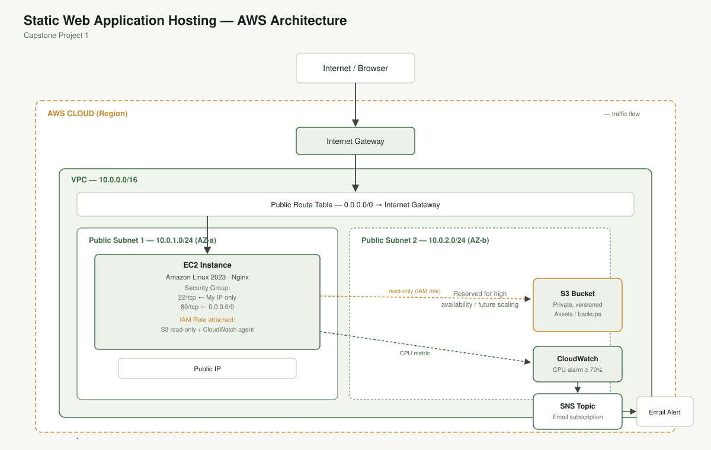

# Capstone Project 1: Static Web Application Hosting on AWS

A secure, highly available static web application hosted on a custom AWS network, provisioned as code, with automated monitoring and alerting.



## Repository layout

```
.
├── README.md                      this report
├── website/
│   ├── index.html                 the static page deployed to EC2
│   └── style.css
├── scripts/
│   └── user_data.sh               EC2 bootstrap script (installs Nginx, deploys the site, installs CloudWatch agent)
├── terraform/                     infrastructure as code for the full architecture
│   ├── network.tf                 VPC, subnets, IGW, route table
│   ├── s3.tf                      private, versioned S3 bucket
│   ├── iam.tf                     least-privilege IAM role for EC2
│   ├── ec2.tf                     security group + EC2 instance
│   ├── monitoring.tf              CloudWatch alarm + SNS topic/subscription
│   ├── variables.tf
│   ├── outputs.tf
│   └── terraform.tfvars.example
└── docs/
    └── architecture-diagram.svg
```

## Architecture summary

| Layer | Resource | Purpose |
|---|---|---|
| Network | VPC `10.0.0.0/16` | Isolated network for the project |
| Network | 2× public subnets (`10.0.1.0/24`, `10.0.2.0/24`), two AZs | Spread across availability zones for resilience |
| Network | Internet Gateway | Only path in/out of the VPC to the public internet |
| Network | Public route table | Routes `0.0.0.0/0` to the IGW, associated with both public subnets |
| Storage | S3 bucket, private + versioned | Website asset/config backups |
| Identity | IAM role on the EC2 instance | Read-only access scoped to the one bucket, plus CloudWatch agent permissions — nothing broader |
| Compute | EC2 instance (Amazon Linux 2023) | Runs Nginx, serves the static page |
| Security | Security group | Port 22 from my IP only, port 80 from anywhere |
| Monitoring | CloudWatch alarm | CPU Utilization > 70% for 2 consecutive 5-minute periods |
| Alerting | SNS topic + email subscription | Notifies on ALARM and OK state changes |

## Step-by-step: how this was built

### Step 1 — Network (VPC)
`terraform/network.tf` creates:
- A VPC with CIDR `10.0.0.0/16`.
- Two public subnets in different AZs (auto-selected via `data.aws_availability_zones`, or pinned with the `availability_zones` variable), each with `map_public_ip_on_launch = true`.
- An Internet Gateway attached to the VPC.
- A public route table with a `0.0.0.0/0 → igw` route, associated with both subnets.

### Step 2 — Storage and security (S3 & IAM)
`terraform/s3.tf` creates a private S3 bucket with versioning enabled, default AES-256 encryption, and all four public-access-block settings turned on.

`terraform/iam.tf` creates an IAM role for EC2 with two policies:
- A **custom, scoped-down policy** granting `s3:ListBucket` and `s3:GetObject`/`GetObjectVersion` on *only* this project's bucket — not `s3:*` or access to every bucket in the account.
- The AWS-managed `CloudWatchAgentServerPolicy`, so the instance can push custom metrics.

This is attached to the instance via an instance profile, following least privilege: the box can read one bucket and report metrics, and nothing else.

### Step 3 — Compute (EC2)
`terraform/ec2.tf` creates:
- A security group allowing SSH (22) from `var.my_ip_cidr` only, and HTTP (80) from `0.0.0.0/0`.
- An EC2 instance (latest Amazon Linux 2023 AMI, looked up dynamically) in the first public subnet, with the IAM instance profile attached and a key pair for SSH.
- `scripts/user_data.sh` runs on first boot: installs and starts Nginx, deploys `website/index.html` and `website/style.css` into `/usr/share/nginx/html/`, and installs/configures the CloudWatch agent for CPU and memory metrics.

### Step 4 — Monitoring and alerting (CloudWatch & SNS)
`terraform/monitoring.tf` creates:
- An SNS **Standard** topic and an email subscription to `var.alert_email`. AWS sends a confirmation email after `terraform apply` — this step is manual by design (AWS does not offer an API to auto-confirm a subscription).
- A CloudWatch alarm on the instance's `CPUUtilization` metric: threshold `> 70%`, evaluated over 2 consecutive 5-minute periods, notifying the SNS topic on both `ALARM` and `OK` transitions.

## How to deploy

1. Install [Terraform](https://developer.hashicorp.com/terraform/install) and configure AWS credentials (`aws configure` or environment variables) for an account/role with permission to create the resources above.
2. Create or choose an existing EC2 key pair in your target region for SSH access.
3. Find your public IP: `curl -s https://checkip.amazonaws.com`
4. Copy the variables template and fill in your values:
   ```bash
   cd terraform
   cp terraform.tfvars.example terraform.tfvars
   # edit terraform.tfvars: my_ip_cidr, key_pair_name, bucket_name, alert_email
   ```
5. Initialize and apply:
   ```bash
   terraform init
   terraform plan
   terraform apply
   ```
6. Check your inbox for the SNS subscription confirmation email and click **Confirm subscription**.
7. Open `http://<web_public_ip>` (from `terraform output web_public_ip`) in a browser to verify the site is live.
8. To test the alarm, you can stress the CPU over SSH: `sudo amazon-linux-extras install -y epel 2>/dev/null; sudo yum install -y stress || sudo dnf install -y stress-ng` then run `stress-ng --cpu 2 --timeout 600s` (or `stress --cpu 2 --timeout 600`) and watch for the alarm/email.
9. When done, tear everything down to avoid charges: `terraform destroy`.

## Screenshots to capture for submission

This report is deploy-ready but running infrastructure isn't provisioned from this environment, so capture these yourself once you `terraform apply` and confirm the SNS subscription:

- [ ] Browser window showing the site at `http://<public-ip>`
- [ ] AWS Console → VPC → your VPC, subnets, route table, and IGW
- [ ] AWS Console → EC2 → instance detail page (showing the attached IAM role, security group, and public IP)
- [ ] AWS Console → S3 → bucket showing versioning enabled and public access blocked
- [ ] AWS Console → CloudWatch → Alarms → your `*-high-cpu` alarm configuration
- [ ] Email inbox → SNS subscription confirmation message (before and after confirming)
- [ ] AWS Console → CloudWatch → Alarms, showing the alarm in `ALARM` state during your stress test (optional but a strong addition)

Drop the screenshots into a `docs/screenshots/` folder in this repo and reference them here, or paste them directly into your submission.

## Cost note

`t2.micro` is Free Tier eligible in most accounts for the first 12 months. S3, CloudWatch alarms (first 10 are free), and SNS email notifications are effectively free at this scale. Run `terraform destroy` when you're done to avoid any ongoing charges.

## Security notes

- SSH is restricted to a single IP via `my_ip_cidr` — update this if your IP changes (home ISPs often rotate).
- The S3 bucket blocks all public access; the only path in is the IAM role's read-only policy.
- The IAM policy is scoped to one bucket ARN rather than using a wildcard resource.
- `terraform.tfvars` (which contains your real IP and email) is gitignored and should never be committed.
